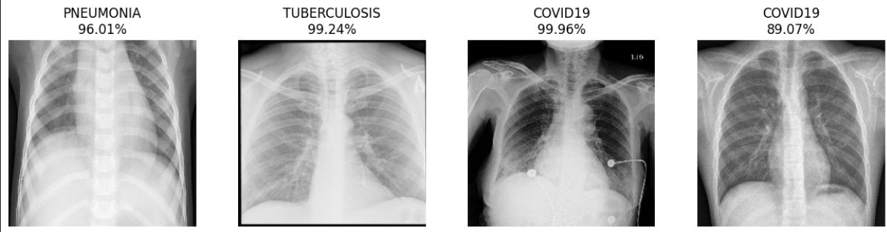

# Multi-Class Chest X-Ray Classification for Respiratory Diseases

## Project Overview 📖

This project presents a deep learning solution for the automated diagnosis of respiratory diseases from chest X-ray images. A Convolutional Neural Network (CNN) is built and trained to perform multi-class classification, distinguishing between four key categories: **COVID-19**, **Normal**, **Pneumonia**, and **Tuberculosis**. The goal is to create a fast and accurate tool to assist medical professionals in diagnosing these conditions.

---

## Dataset 📂

The model is trained on a dataset of chest X-ray images organized into four folders, each corresponding to one of the classes. All images are resized to a uniform `224x224` pixels before being fed into the network.

**Data Augmentation** is used to artificially expand the dataset and prevent overfitting. The following transformations are applied to the training images:
* Rotation
* Width and Height Shifts
* Shear transformations
* Zoom
* Horizontal Flipping

---

## Model Architecture 🧠

A Convolutional Neural Network (CNN) was designed and implemented using TensorFlow and Keras. The architecture consists of sequential convolutional and pooling layers, followed by dense layers for classification.

* **Convolutional Layers:** Use `Conv2D` with the `ReLU` activation function to extract features like edges and textures from the images.
* **Max Pooling Layers:** `MaxPooling2D` layers are used to down-sample the feature maps, reducing computational complexity and making the model more robust to variations in feature positions.
* **Dropout Layer:** A `Dropout` layer is included to prevent overfitting by randomly setting a fraction of input units to 0 during training.
* **Flatten Layer:** This layer converts the 2D feature maps into a 1D vector.
* **Dense Layers:** Fully connected layers that perform the final classification. The output layer uses a `softmax` activation function to produce a probability distribution over the four classes.

---

## Results and Evaluation 📊

The model's performance was rigorously evaluated. An experiment was conducted to find the best optimizer, and the final model's performance was analyzed using a confusion matrix and a classification report.

### Optimizer Comparison

Different optimizers were compared based on their validation accuracy. The **Adam** optimizer demonstrated the best performance, achieving the highest accuracy among the tested options.


### Final Model Performance

The final model, trained with the Adam optimizer, shows excellent performance on the test set. The confusion matrix and classification report provide a detailed breakdown of its predictive accuracy for each class. The model demonstrates high precision and recall, especially for identifying 'NORMAL' and 'TUBERCULOSIS' cases.



---

## How to Run 🚀

1.  **Clone the repository:**
    ```bash
    git clone [https://github.com/your-username/chest-xray-classification.git](https://github.com/your-username/chest-xray-classification.git)
    cd chest-xray-classification
    ```
2.  **Prepare the Dataset:**
    Organize your dataset into a root folder with four sub-folders named `COVID19`, `NORMAL`, `PNEUMONIA`, and `TUBERCULOSIS`.

    ```
    dataset/
    ├── COVID19/
    │   ├── image1.png
    │   └── ...
    ├── NORMAL/
    │   ├── image1.png
    │   └── ...
    ├── PNEUMONIA/
    │   ├── image1.png
    │   └── ...
    └── TUBERCULOSIS/
        ├── image1.png
        └── ...
    ```
3.  **Run the Jupyter Notebook:**
    Open and run the `MLFinal.ipynb` notebook in an environment like Google Colab or Jupyter Lab. Make sure to update the file paths to point to your dataset's location.

---

## Dependencies 📦

* TensorFlow
* Keras
* Scikit-learn
* Matplotlib
* Seaborn
* NumPy
